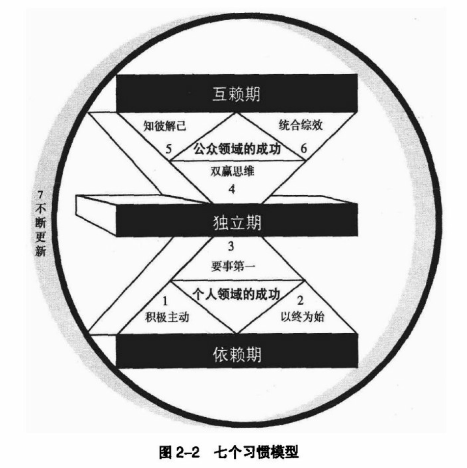

# 长期主义与成长思维

[toc]
<!--toc-->

## 长期主义与终生学习

- **保持好奇心**
    - 保持好奇心是主动大量阅读的基础.
    - 知识可以让我们更细粒度解构世界.
    - 数理哲学可以让我们思考得更远.
    - 真正享受结构化知识和分享的过程.

- **常开上帝视角**
    - 从量子涨落到宏观实体
        - 从海森堡的不确定性原理我们可以知道,虚空之中每时每刻都会有大量正负虚粒子对凭空生成并且在碰撞时重新湮灭,简单理解为 你向虚空借了点正能量,虚空同时生成负能量,正负得0,仿佛什么都没有生成,这个系统的总能量依然是0. 正常的年景,好借好还再借不难.而在不完美的年景,借出去的能量一时半会儿还不回去会发生什么. 延伸到宇宙的诞生, 或许在某一个十分短暂的时间内, 虚空中突然发生了量子涨落, 导致瞬间能量暴增, 炸出了我们的宇宙, 同时也炸出了一个"负宇宙", 正负得0, 看似什么也没有改变, 但是我们的宇宙就这样神奇地出现了.

    - 从大爆炸到可视宇宙到多维时间线
        - 宇宙曲率结构是平坦的,并且在暗能量加持下还在加速膨胀,在某个边界,连光都追不上空间膨胀的速度.这个边界内就是地球视角下的可视宇宙.可视宇宙之外的东西对人类而言将永远不可知.
        - 光锥之内即是命运,所有人都逃不出自己的光锥.想象一下从你出生的那一刻起,一个以你为中心的球便以光速扩散,你此生之内能靠主观去改变的世界便永远被禁锢在这个球之内.
        - 人生80多光年,不过3万多天,随着时间的流逝,每个人的时间线可以分叉的机会将会越来越少.

    - 从原始汤到星球文明到星际文明
        - 对能量的不同的掌控规模决定了一个文明的发展水平.
        - 对人类文明真正有推进作用的其实还是科学/思想理论的发展.人类文明所做的一切活动99%是后勤维护性质的,维护系统稳定和种群繁衍,无论政治经济文化如何折腾跳跃,它都是那99%,都是为了酝酿那1%的开创性事务. *香农定理->信息传输的极限; 超导+托卡马克->可控核聚变; 深度神经网络->人工智能; 去中心化思想->区块链,web3; 无工质推进技术(太阳帆)->星际旅行.*
        - 初级宇宙时代只需要三大技术和一项新的法理基础:强人工智能,可控核聚变,无工质推进技术,星际资源共同所有制(人类命运共同体).

    - 从古代到近代到现代到近未来
        - 跳脱出时代去思考问题.
            - 人类进入工业时代不过200多年,从莱特兄弟到阿姆斯特朗不到70年,进入信息时代也不过近几十年.对这个时代的大部分人来说,这是个进步的时代,跳过了刀耕火种与黑暗封建,进入到一个发展中的不稳定的初级地球文明时期,冲突与浪潮此起彼伏,精彩纷呈,人工智能和量子计算才刚刚起步.这也是个技术爆炸的时代,创新在许多领域攻城拔寨迅速饱和.许多厉害的人能够为推动文明的进化与发展贡献自己的一丝智慧与力量,对他们来说这是个能够实现个人理想的好时代.而与此同时,对大部分人来说,这也是个生不逢时的早期时代.私有制是行星有限资源下的最优解,地区之间和社会层级间的资源分配问题也尤为突出,同时也会导致以人为本的人文主义的普遍欠缺.虽然从奴隶制到封建制,共和制,文艺复兴等一步步的思想解放,可依然还差点味道,还差至少一次思想解放运动,但这又依赖于生产力和生产关系的进一步提高.
            - 从行星空间发展到星际空间才是人类真正的未来,社会制度和所有制形式必然会发生结构性改变以适应新的星际资源分配形势.这一切仰赖于受过高等教育的人的自我觉醒.
        - 跳脱出国家,文化,传统,道德...去思考真正的本质和对的事情.
            - 除了宏观叙事奠定基调之外,还要结合对社会和现实的洞察,一切社会规范只是适合当下时代,称之为适应决不能称为真理.
            - 人类的痛苦大都是由故事和价值观带来的,宗教故事引发宗教战争,足球故事引发足球战争,传统故事引发社会压迫,伟大复兴引发自我压迫.
            - 种群基因只需要社会面延续,人类社会曾经过无数次天灾人祸,击毁和重建.一块土地上的人早已不是最初的那批人的子嗣,一群有同一个共同祖先的人到今天也是形同陌路的.为家族撰取的利益只能维持几代人罢了.家庭/家族制是社会自发产生的局部最优模式.基于血缘关系的组织结构短期来看可以增加生存优势,长期来看,和领养孩子并无区别.(人类命运共同体)

    - 从芯片到主机到程序到非中心化网络
        - 从二进制到用户界面,中间的一切层级都是对服务,数据和设备的层层抽象和建模.
        - 人本主义将会催生非中心化网络格局的形成,从你的数据由服务提供商管理并提供服务转变到你的数据由自身管理,不同服务提供商获取你的授权和数据,为你提供服务.

    - 从血泪劳工到王侯将相
        - 世界历史由特权阶级的恩怨史定义.
        - 特权阶级的软弱性在于,只会想方设法维持阶级稳定从而忽略全局优化解.
        - 生产性劳动是风险最大的劳动方式.因为所要付出的代价在这个时代一文不值,在另一个时代又弥足珍贵.

    - 从局部空间到全局空间
        - 地球诞生高等生命有着及其苛刻的条件:需要处在恒星系统宜居带上;需要一个长期稳定的恒星;需要有个合适的卫星引发潮汐作用;需要地轴偏转22度左右以免永冬;需要是岩石星球能够产生地磁力;需要木星一样的守护吸引陨石;需要液态水和稳定的大气层等等.是幸存者也是天选之地.
        - 相比于黄金白银,生命才是宇宙中最稀缺的资源,是对抗熵增的艺术奇迹.生命在地球的局部空间上富集从而显得廉价无比,而在全局空间中又是最稀缺的资源.
    - ...

- **简化生活**
    - 追求自身人格平稳运作的最低成本,将精力放到更重要的事情上.
    - 生命短暂,生活中有大量无关紧要鸡毛蒜皮的小事,有无数半斤八两的选择, 学会不给予过多关注, 迅速从中脱身, 是很重要的技能. <天道>中有个情节是,明明已经付过早餐店老板钱了,老板没看到又让你付了一次,主角选择了再付一次,而不是跟早餐店老板争执,因为比起争执的时间和一天的好心情,一点早餐钱反而是无关紧要的.
    - 减少多巴胺带来的上瘾和渴望,享受痛苦和内啡肽带来的愉悦感,兴奋感及成就感.

- **顺势而为**
    - 顺势而为的前提是持续提升综合能力及认知水平.
    - 富在术数不在劳身,利在势局不在力耕.
    - 保持钝感力,关注感知"势",而非无关紧要的细节.

- **扩展生命的长度以及宽度**
    - 每个人都有自己不同的人生节奏,际遇以及寿命.
    - 拥抱不稳定性. 不要让自己在一件事情上重复10年.
    - 科学的尽头是玄学,脱虚向实是我们唯一能做的事情.
    - 一期一会.退休可能多了时间,但也会丧失年轻时的热血和心态.
    - 最重要的是以自己的方式度过自己的一生.

- **长期主义**
    - 经济危机总会过去,不要为一时的得失停滞不前.
    - 将一件事情放到10年,20年,30年的长度去思考.摒弃狭隘的悲观与乐观.
    - 腾出时间做自己真正热爱的事情.
    - 事物的发展总是曲折前进的,能伸能屈,无论需要妥协还是曲线救国,都别忘了你的目标.

- **终生学习**
    - 大脑是人体老化最慢,可塑性最强的器官,用进废退.
    - 一以贯之的努力,不得懈怠的人生,才是适用于任何时代的不二法门.
    - 任何时候行动起来都不算晚.

- **被动收入**
    - 被动收入是需要最少劳动力来赚取和维持的收入
    - 被动收入是自由的保障,如果你没找到一个当你睡觉时还能赚钱的方法,你将工作到死
    - 有意识的准备/开始构建自己的被动收入,越早越好
    - 从自己擅长的事情入手,以长期主义的思想去打磨变现.

---
## 思维的标准
- 清晰性
    - 能进一步详细描述吗？
    - 能举个例子吗？
    - 能阐明要表达的含义吗？
- 准确性
    - 怎样进行核实？
    - 怎样查明是真的？
    - 怎样查证或证实？
- 精确性
    - 可以更精细一点吗？
    - 能有更多细节吗？
    - 能更精确吗？
- 相关性
    - 它如何与问题相联系？
    - 它如何支持这个问题？
    - 它如何在这个问题上对我们有益？
- 深度
    - 哪些因素提升问题的深度？
    - 这个问题的复杂性是什么？
    - 哪些困难是我们需要着手解决的？
- 广度
    - 需要从另一个视角看问题吗？
    - 需要考虑另一种观点吗？
    - 需要从其他方式看待问题吗？
- 逻辑性
    - 所有这些组合起来有意义吗？
    - 起初的观点符合最后的论述吗？
    - 你所说的有据可依吗？
- 重要性
    - 这是需要考虑的重要问题吗？
    - 这是需要聚焦的中心观点吗？
    - 这些因素哪些是最重要的？
- 公正性
    - 我的想法在情境中合理吗？
    - 我考虑到别人的想法了吗？
    - 我的目的在该情境下公平吗？
    - 我使用概念的方法合理吗？
    - 我是否扭曲了观点来谋取自己的私利？
---
## 七个习惯概论

- 习惯的定义: 知识、技巧、意愿的结合体
    - 知识: 指点"做什么" "为何做"
    - 技巧: 告诉"如何做"
    - 意愿: 促使"想要做"
    - 三者共同作用, 缺一不可, 从而合为习惯: 知道要做啥, 还要知道该怎么做, 更重要的是愿意去做.
- 成熟模式图(思维成长的三阶段)
    - 依赖: 依赖别人达成愿望与目的——不成熟
    - 独立: 单枪匹马打天下——成熟
    - 互赖: 群策群力达成更高成就——更高层次的成熟
    - 三者依次渐进, 摆脱依赖变得独立是进入互赖模式的基础
- 个人领域与公共领域的关系
    个人领域的完善意味着进入成熟模式的独立期, 你需要培养前三个习惯
    公共领域的完善意味着进入成熟模式的高级互赖阶段, 你需要培养后四个习惯.
- 效能平衡原则
    - 效能在于产能与产出的平衡
    - 产能为生金蛋的资产或能力,产出即金蛋.
    - 三类资产的产能与产出平衡
        - 物质资产
        - 金融资产
        - 人力资产
    - 团体产能也需要满足产能与产出平衡的原则
    - 效能原则是七个习惯的基础
---
