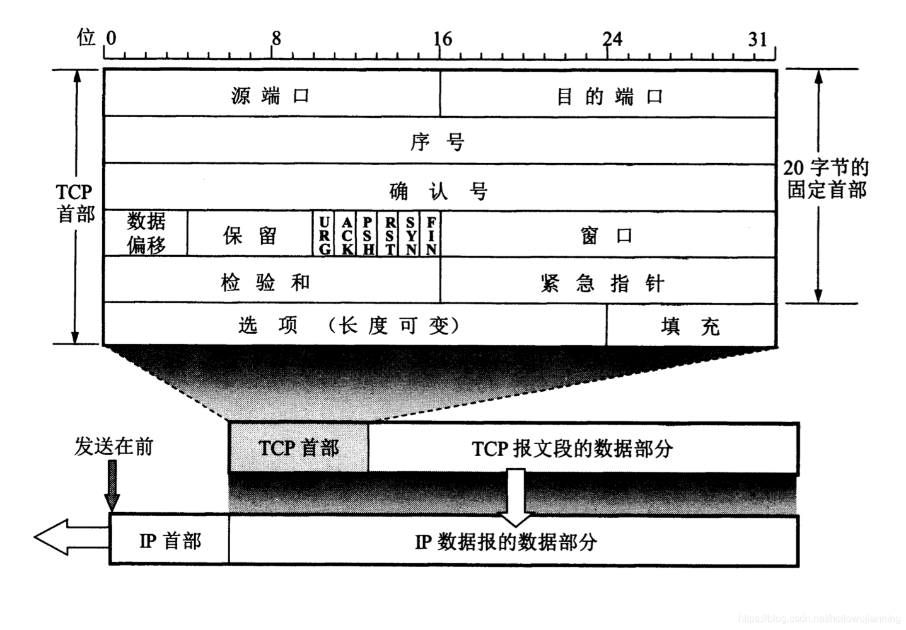
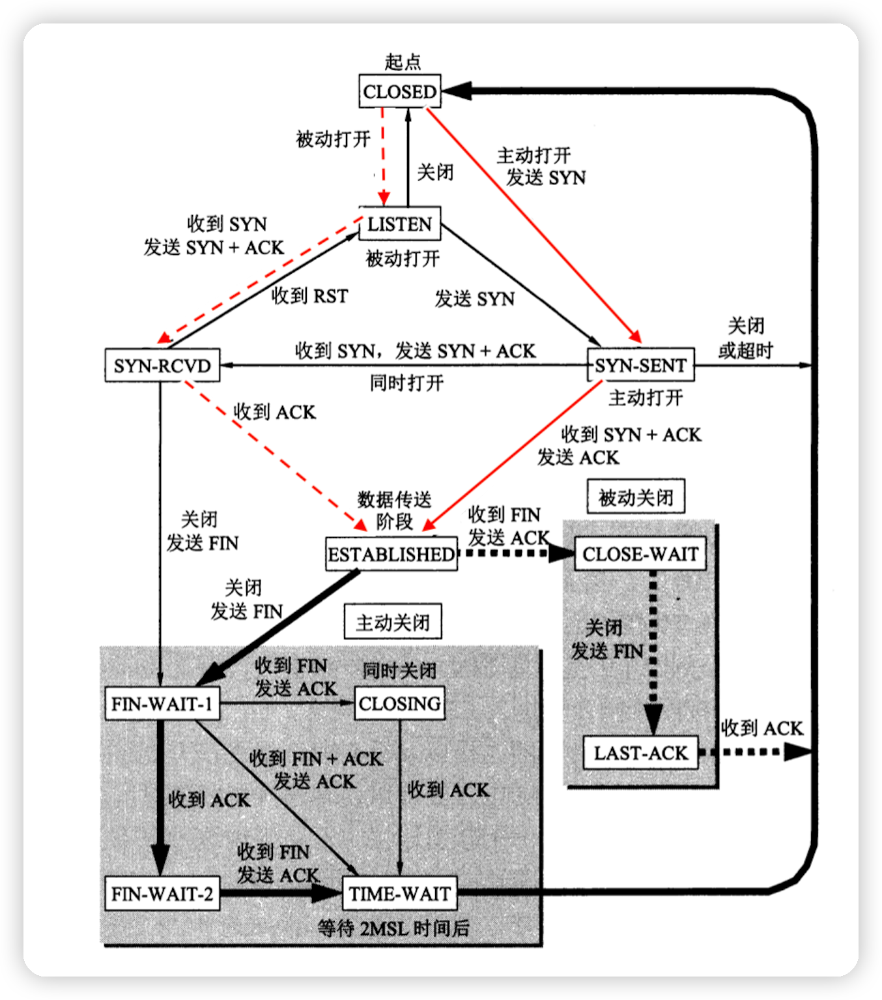
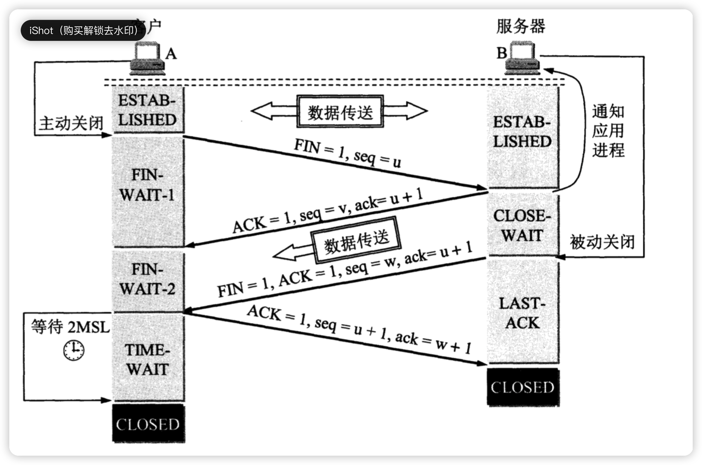
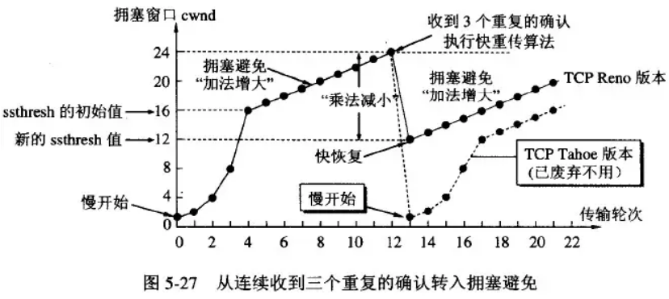

# 网络协议要点及编程方法

[toc]
<!--toc-->

## 协议
### IP
- 特点
    - 无状态,无连接,不可靠(丢失、重复、延迟或乱序)
    - IP主要包含三方面内容：IP编址方案、分组封装格式(IP分片)及分组转发规则(IP路由)
- IP数据报 首部20B最大60B


### UDP
- 特点
    - 无连接,适合小数据或流媒体
    - 在IP数据包上增加**复用分用**和**差错检测**服务
    - 面向报文,报文不可分割,一次交付一个完整报文,不合并,不拆分

- UDP数据包 首部8B

|2B(16位)|2B(16位)|
|---|---|---|
|源端口号(可为0)|目的端口号|
|UDP长度(最小值8)|UDP校验和(可为0)|

校验方式: 添加伪IP首部然后用二进制反码运算求和再取反,对整个发送包都进行了校验.检错能力不强但处理速度快.

### TCP
- 特点
    - 可靠性连接,全双工通信(接发缓冲区)
    - 面向字节流,逐个字节传送.

- TCP报文段 首部20B最大60B


|字段|意义|解释|
|---|---|---|
|序列号|报文段数据首字节序号|TCP传送是面向字节流的逐字节传送.解决网络包乱序.|
|确认号|期望收到的下一报文段的首字节序号|确认号之前的字节已收到.解决网络包丢失.|
|数据偏移|首部长度(4bit)|报文段开头到数据部分开头的长度,步进4B,1111=15=最大4*15=60B|
|UAG|紧急位|配合紧急指针,高优先级传送紧急数据.|
|ACK|确认位|ACK=1,确认号字段有效,连接建立后所有报文段需置1.|
|PSH|推送位|不必等待缓冲区满,第一时间向上交付/发送数据.|
|RST|复位位|连接出错,必须重新建立连接.|
|SYN|同步位|表示连接请求报文(SYN=1,ACK=0),连接接收报文(SYN=1,ACK=1).|
|FIN|终止位|要求释放连接.|
|窗口|接收窗口大小(2B)|发送方接收窗口大小,单位字节|
|紧急指针|紧急数据大小(2B)|紧急数据放在本报文段数据部分的开头.|
|选项|可选字段|例如最大报文段长度MSS(数据字段的最大长度)|
|填充|0字段|为了使首部长为4B整数倍|

- **TCP连接建立与断开过程**
    - **TCP3次握手**
    连接请求(C->S)
    连接接收(S->C)
    连接确认(C->S)
    

    - **TCP3次握手的状态转移过程**
    

    - **TCP4次挥手**
    连接释放请求(C->S)
    确认请求(S->C)
    连接释放(S->C)
    确认连接释放(C->S), 等待完全释放(C)
    
    **等2MSL原因**:
        - 保证最后的ACK能被S收到, 如果收不到S会重传FIN报文.
        - 确保重新建立连接的时候, 网络中残存的数据包都已丢失.

- **TCP可靠传输**
    - **序号**
        - 面向字节流,为每个字节编上序号.
    - **确认**
        - 发送缓冲区会缓存已发送但未接收到确认的报文段,以便需要时重传.
        - TCP默认使用累积确认,只确认还未收到的第一个字节.
    - **重传**
        - **超时重传**
            - 对每个发送的报文段计时,到期未收到确认则超时重传.
            - RTTs加权平均往返时间: `RTTs = 7/8 * oldRTTs + 1/8 * newRTT`
            - RTTd为RTT(Round-trip time)的偏差加权平均值: `RTTd= 3/4 * oldRTTd + 1/4 * |RTTs-newRTT|`
            - 超时重传时间RTO(Retransmission Time Out): `RTO = RTTs + 4 * RTTd`
        - **冗余ACK(快速重传)**
            - TCP规定,每当比确认号大的失序报文段到达时,就发送一个冗余ACK,重新声明确认号.
            - TCP规定,收到`3个冗余ACK`,就认为确认号之后的报文段已经丢失,发起快速重传.

- **TCP流量控制**
    - 接收方控制发送方,点对点通信量的控制,抑制发送方发送速率以便来得及接收.
    - **滑动窗口**
        - 窗口数值单位: 最大报文段长度MSS
        - 根据接收缓冲区大小调整**接收窗口**`rwnd`
        - 根据网络拥塞情况(超时)调整**拥塞窗口**`cwnd`
        - **发送窗口**上限 `snd_wnd = min(rwnd,cwnd)`

- **TCP拥塞控制**
    - 发送方根据拥塞程度自控,让网络能够承受现有的网络负荷,是一个协议全局性的策略.
    
    - **慢开始**
        - 刚开始cwnd=1,每经过一个RTT就加倍(指数增长),直到阈值`ssthresh`
    - **拥塞避免**
        - 每经过一个RTT增加1个MSS(线性增长),出现一次超时就退半避让`ssthresh=1/2*cwnd`~~,并且回到慢开始算法置`cwnd=1`(快恢复改进这点,不再置1)~~
    - **快重传**
        - 收到连续3个重复的ACK时,直接重传对方未收到的报文段,而不必等待超时重传.
    - **快恢复**
        - (Reno)收到连续3个重复的ACK时,跳过慢开始过程,置cwnd为退半避让后的阈值`ssthresh=1/2*cwnd`,退出快恢复状态进入拥塞避免阶段.
        - (NewReno)收到多组连续3个重复的ACK时,跳过慢开始过程,置cwnd为退半避让后的阈值`ssthresh=1/2*cwnd`,当所有丢失的包都重传并收到确认后才退出快恢复.

    - TCP版本:
        - Tahoe: 慢开始 拥塞避免 快重传
        - Reno: 比Tahoe多了快恢复
        - NewReno: 改进Reno对丢失多个包的快恢复过程[(恢复应答判断)](https://cloud.tencent.com/developer/article/2102708)

### KCP

- **特点**
    - 以流量换流速的具有可靠性的协议栈`header only`.(建议基于UDP)
    - 平均RTT减少30%-40% VS TCP
    - 最大RTT减少3倍 vs TCP
- KCP分片 首部24B
```
|<------------ 4 bytes ------------>|
+--------+--------+--------+--------+
|               conv                | conv: 会话序号
+--------+--------+--------+--------+ cmd:  指令类型
|  cmd   |  frg   |       wnd       | frg:  分片序号
+--------+--------+--------+--------+ wnd:  接收窗口大小
|                ts                 | ts:   发送的时间戳
+--------+--------+--------+--------+
|                sn                 | sn:   包序号
+--------+--------+--------+--------+
|                una                | una:  当前未收到的序号
+--------+--------+--------+--------+
|                len                | len:  数据段长度
+--------+--------+--------+--------+
```

|字段|意义|解释|
|---|---|---|
|conv|会话序号|标识一段会话连接|
|cmd|指令类型|数据包IKCP_CMD_PUSH, ACK包IKCP_CMD_ACK, 窗口探测包IKCP_CMD_WASK, 窗口回应包IKCP_CMD_WINS|
|frg|分片倒序号|当输出数据大于MSS时,需要将数据进行分片.收到0时代表接收完毕.|
|wnd|接收窗口大小|用于流控, 也就是rcv_queue的可用大小|
|ts|发送时间戳|用来估计 RTT.|
|sn|包序号| |
|una|unacknowledged|当前未收到的序号: 即代表这个序号之前的包均收到.|
|len|数据段长度| |

%accordion% [ikcp.hpp](https://github.com/Mainvooid/kcp-hpp/blob/master/ikcp.hpp) %accordion%



%/accordion%

### TCP & KCP 的区别
TCP是为流量设计的(每秒内可以传输多少KB的数据), 讲究的是充分利用带宽.而 KCP是为流速设计的(单个数据包从一端发送到一端需要多少时间), 以10%-20%带宽浪费的代价换取了比 TCP快30%-40%的传输速度.KCP有正常模式和快速模式两种, 通过以下策略达到提高流速的结果：

- **RTO翻倍 vs 不翻倍**
    TCP超时计算是RTOx2, 这样连续丢三次包就变成RTOx8了, 十分恐怖, 而KCP启动快速模式后不x2, 只是x1.5(实验证明1.5这个值相对比较好),提高了传输速度.

- **选择性重传 vs 全部重传**
    TCP丢包时会全部重传从丢的那个包开始以后的数据, KCP是选择性重传, 只重传真正丢失的数据包.

- **快速重传**
    TCP的快速重传写死了是3次, KCP可以自己设置, 一般是2次.

- **延迟ACK vs 非延迟ACK**
    TCP为了充分利用带宽, 延迟发送ACK(NODELAY都没用), 这样超时计算会算出较大 RTT时间, 延长了丢包时的判断过程.KCP的ACK是否延迟发送可以调节.

- **UNA vs ACK+UNA**
    ARQ模型响应有两种, UNA(此编号前所有包已收到, 如TCP)和ACK(该编号包已收到), 光用UNA将导致全部重传, 光用ACK则丢失成本太高, 以往协议都是二选其一, 而 KCP协议中, 除去单独的 ACK包外, 所有包都有UNA信息.

- **公平流控 vs 非退让流控**
    KCP正常模式同TCP一样使用公平退让法则, 即发送窗口大小由：发送缓存大小、对方接收窗口大小、拥塞窗口大小决定.但传送及时性要求很高的小数据时, 可选择通过配置开启快速模式(nodelay,不计算网络拥塞程度), 仅用前两项来控制发送窗口.无视全局性网络拥塞状况,有失公平,但确实快.

- **字节流 vs 报文分片流**
    KCP发送方式有流方式或消息方式, 若要发送的数据量大于MSS则都需要包分片,开启流模式会取出发送队列最后一个报文,将其填充到MSS的长度,充分利用传输空间,


### TCP/UDP/KCP三用的传输系统
中国的网络情况比较特殊, 会存在有些网络 UDP连接不上的情况, 因此都是先连接 TCP, 然后试图 UDP, UDP不通的情况下, 退回 TCP也能正常服务, 一旦 TCP断开, 则认为 UDP也断开了.

**建立TCP连接到UDP连接的映射关系**
先TCP连接,而后UDP握手传送UUID.将传送UUID的UDP端口和已知TCP连接绑定.为了保持连接和NAT映射关系, 客户端一般需要每60秒就发送一个UDP心跳, 服务端收到后回复客户端, 在这个UDP保活连接的基础上可以增加调用KCP的逻辑, 实现更快速的可靠传输.

### ICMP

### HTTP/HTTPS
- HTTP 与 HTTPS 有哪些区别？
    - HTTP 是超文本传输协议，信息是明文传输，存在安全风险的问题。HTTPS 则解决 HTTP 不安全的缺陷，在 TCP 和 HTTP 网络层之间加入了 SSL/TLS 安全协议，使得报文能够加密传输。
    - HTTP 连接建立相对简单， TCP 三次握手之后便可进行 HTTP 的报文传输。而 HTTPS 在 TCP 三次握手之后，还需进行 SSL/TLS 的握手过程，才可进入加密报文传输。
    - HTTP 的端口号是 80，HTTPS 的端口号是 443。
    - HTTPS 协议需要向 CA（证书权威机构）申请数字证书，来保证服务器的身份是可信的。
- HTTPS 采用的是对称加密和非对称加密结合的「混合加密」方式：
    - 在通信建立前采用非对称加密的方式交换「会话秘钥」，后续就不再使用非对称加密。
    - 在通信过程中全部使用对称加密的「会话秘钥」的方式加密明文数据。
- 采用「混合加密」的方式的原因：
    - 对称加密只使用一个密钥，运算速度快，密钥必须保密，无法做到安全的密钥交换。
    - 非对称加密使用两个密钥：公钥和私钥，公钥可以任意分发而私钥保密，解决了密钥交换问题但速度慢。
- 摘要算法 + 数字签名
    - 摘要即通过哈希算法来保证消息的完整性
    - 数字签名就是对内容的哈希值加密，通过「CA私钥加密，客户端公钥解密」的方式，来确认消息的身份
- 数字证书  
    - 通过数字证书的方式保证服务器公钥的身份，解决冒充的风险
- SSL/TLS 协议基本流程：4次握手
    - 客户端向服务器索要并验证服务器的公钥。
    - 双方协商生产「会话秘钥」。
    - 双方采用「会话秘钥」进行加密通信。

## socket

### epoll

- select&epoll高效的本质
    - 减少用户态和内核态之间的文件句柄拷贝,节约掉了大量的进程上下文切换.
    - 减少对可读可写文件句柄的遍历(中断唤醒)

- `epoll_create`创建一个epoll对象,一般`epollfd = epoll_create()`
- `epoll_ctl(epollfd, EPOLL_CTL_ADD, socket, EPOLLIN);`//缓冲区内有数据时epoll_wait返回
- `epoll_ctl(epollfd, EPOLL_CTL_DEL, socket, EPOLLOUT);`//缓冲区可写入时epoll_wait返回
- `epoll_wait(epollfd,...)`等待直到注册的事件发生
- `select`

### kqueue
kqueue与epoll非常相似.注册一批socket描述符到 kqueue以后,当其中的描述符状态发生变化时,kqueue 将一次性通知应用程序哪些描述符可读,可写或出错了.
- `kqueue()`生成一个内核事件队列,返回该队列的文件描述符.
- `kevent()`提供向内核注册/反注册事件和返回就绪事件或错误事件
```cpp
struct kevent { 
     uintptr_t ident;        /* 事件 ID */ 
     short     filter;       /* 事件过滤器 */ 
     u_short   flags;        /* 行为标识 */ 
     u_int     fflags;       /* 过滤器标识值 */ 
     intptr_t  data;         /* 过滤器数据 */ 
     void      *udata;       /* 应用透传数据 */ 
 }; 
```
